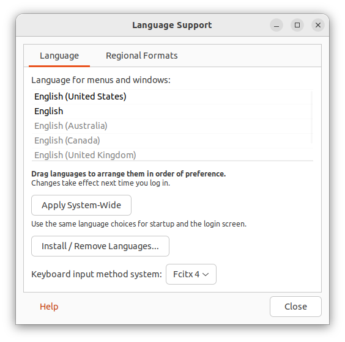
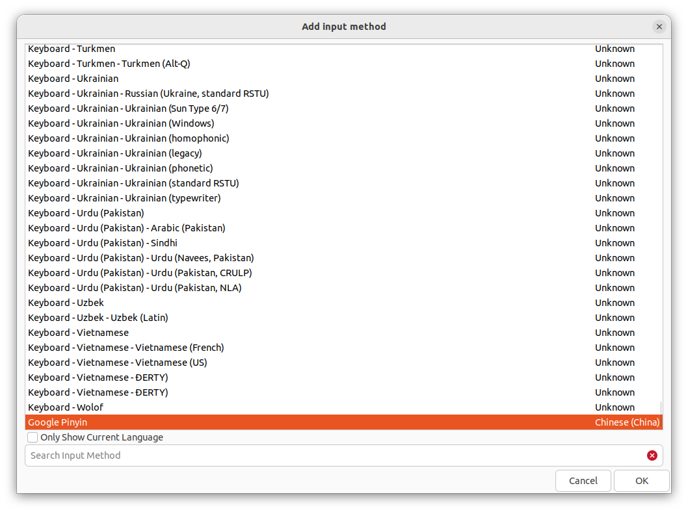

# Set up Go on Ubuntu

Install Git:

    sudo apt install git

Install Go:

Get the link from [https://go.dev/doc/install](https://go.dev/doc/install)

```bash
rm -rf /usr/local/go
wget -qO- https://go.dev/dl/go1.19.3.linux-amd64.tar.gz | sudo tar xvz -C /usr/local

cat >> ~/.bash_aliases << 'EOF'

export PATH=$PATH:/usr/local/go/bin

EOF
```

# Set up C++ on Ubuntu

    sudo apt install build-essential

# Set up rsynch on Ubuntu

    sudo apt install rsync

Archive (maintain timestamp), update only if diff (meaning different modification time or size), delete dir on destination if sourc no longer has it:

    rsync --archive --update --delete --itemize-changes --stats ~/GolandProjects/ /media/wsuvago/USB/GolandProjects

# Install Chinese Input on Ubuntu

    sudo apt install fcitx-googlepinyin

1. Reboot
1. Click All Application
1. Launch `Language Support`.
1. In `Keyboard input method system`, select `Fcitx 4`. 
1. Launch `Fcitx Configuration`.
1. Click `+`.
1. Check off `Only Show Current Language`
1. Select `Google Pinyin`, and select `OK`. 
1. Reboot if needed.

To switch between keyboards press `Ctrl+Space`
